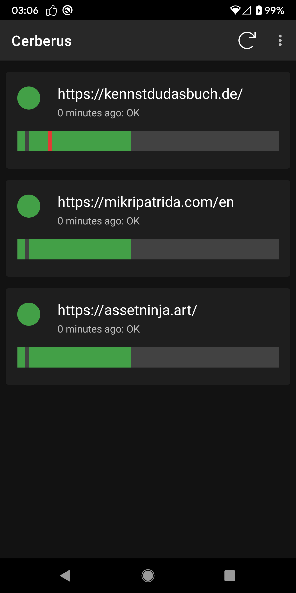
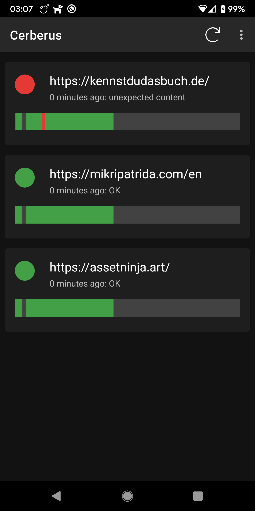
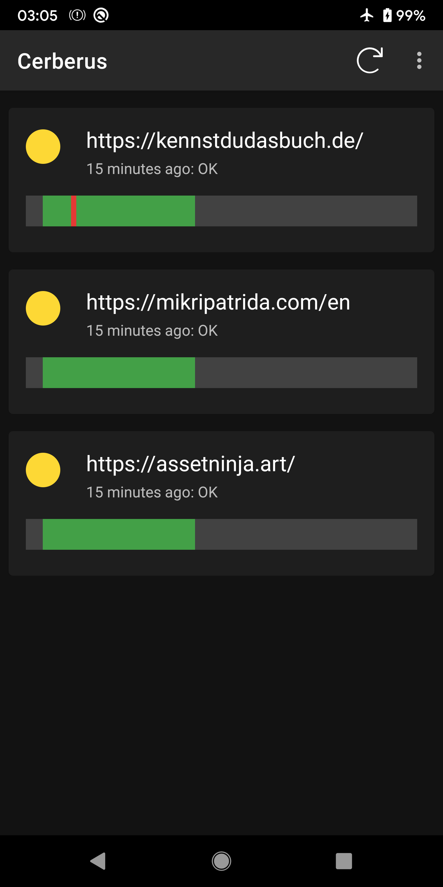
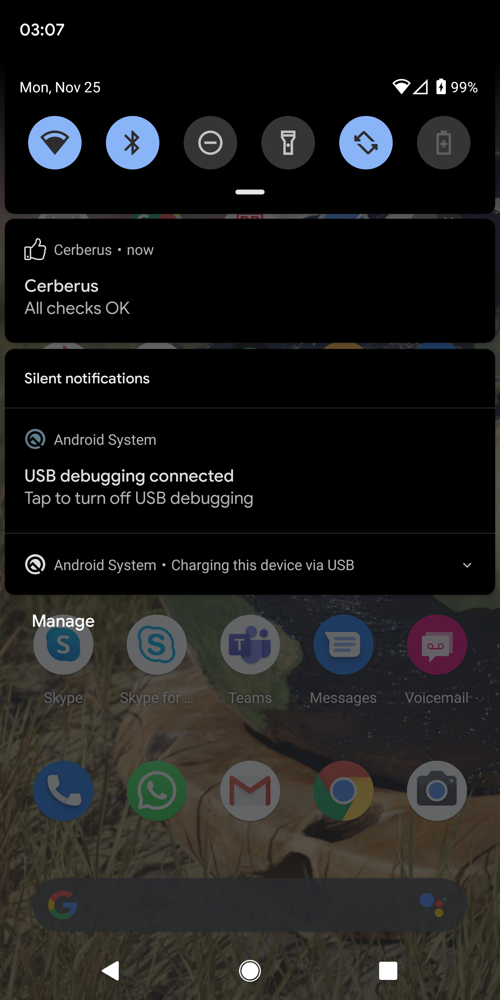
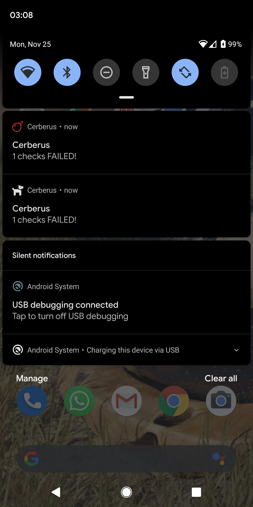
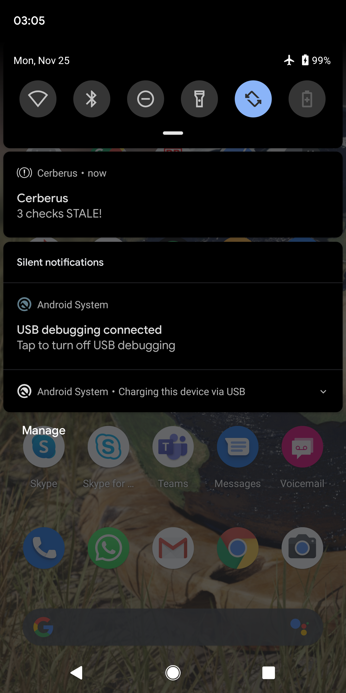

# Cerberus
Cerberus is a simple web service monitoring app for Android. It is currently work in progress.

<table><tr><td></td><td></td><td></td></tr><tr><td></td><td></td><td></td></tr></table>

## Authors and Contributors

Authored and maintained by Niklas Salmoukas [[@GitHub](https://github.com/core-process) [@LinkedIn](https://www.linkedin.com/in/salmoukas/) [@Xing](https://www.xing.com/profile/Niklas_Salmoukas) [@Twitter](https://twitter.com/salmoukas) [@Facebook](https://www.facebook.com/salmoukas) [@Instagram](https://www.instagram.com/salmoukas/)].
